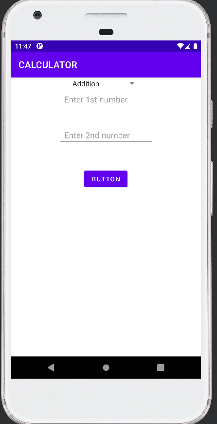
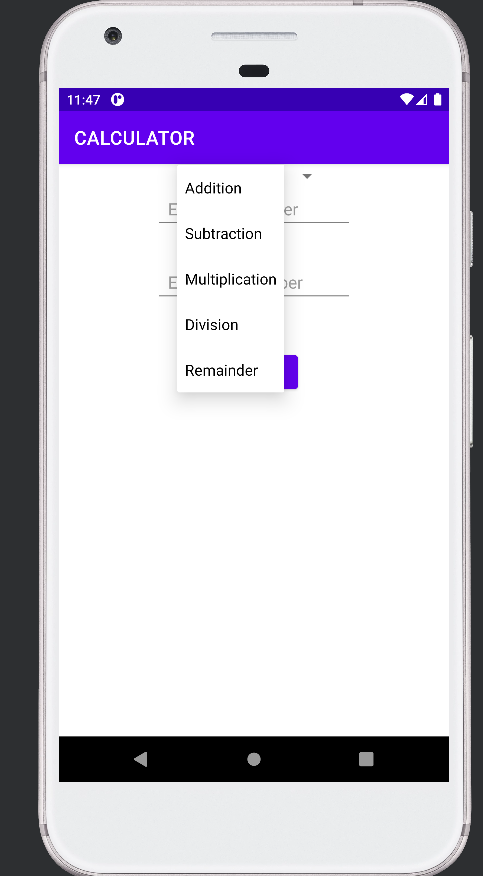
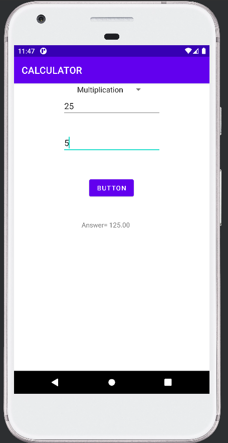
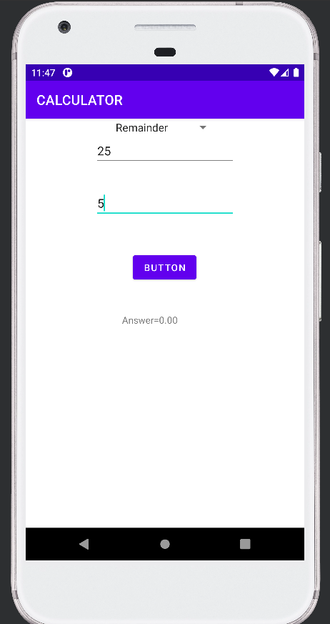
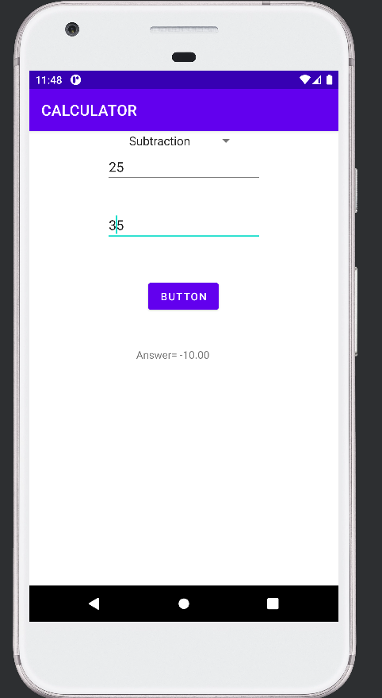
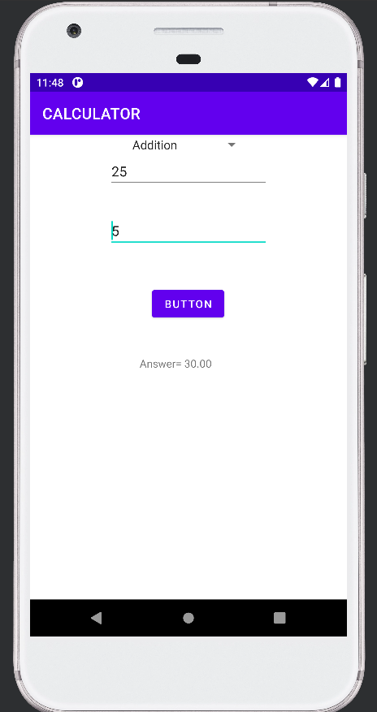
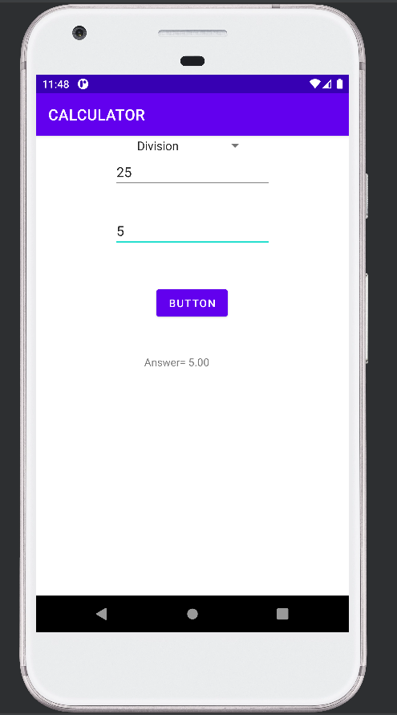

# Android Calculator App

This Android application performs basic arithmetic operations such as **addition, subtraction, multiplication, division, and modulus**.

The app is built using **Java and Android Studio** and demonstrates how Android UI components like **EditText, Button, Spinner, and TextView** can be used to create an interactive calculator application.

---

## Purpose

This project was created as a learning exercise to understand how to build a **basic calculator application in Android**.

It demonstrates how to:

- Take numeric input from users
- Use a **Spinner dropdown menu** to select mathematical operations
- Perform arithmetic calculations using Java
- Display results dynamically in an Android user interface

---

## Features

- Addition of two numbers
- Subtraction of two numbers
- Multiplication of two numbers
- Division of two numbers
- Modulus operation
- Operation selection using **Spinner**
- Result displayed with formatted output
- Input validation for empty fields

---

## Technologies Used

- Java
- Android Studio
- Android SDK
- XML Layouts
- Spinner (Dropdown UI Component)

---

## Project Structure

Main components of the project:

- `MainActivity.java` → Handles user input, spinner selection, and arithmetic calculations  
- `activity_main.xml` → Defines the user interface layout  
- `strings.xml` → Stores operator values for the Spinner dropdown  

---

## How the App Works

1. The user enters two numbers in the input fields.
2. The user selects a mathematical operation from the **Spinner dropdown**.
3. The user presses the **Calculate button**.
4. The application performs the selected arithmetic operation.
5. The result is displayed on the screen.

Example:

```
Input: 10 and 5
Operation: Addition
Output: Answer = 15.00
```

---

## Screenshots

<p align="center">
  
  
  
</p>

<p align="center">
  
  
  
  
</p>

---

## Author

Rishi Singh
